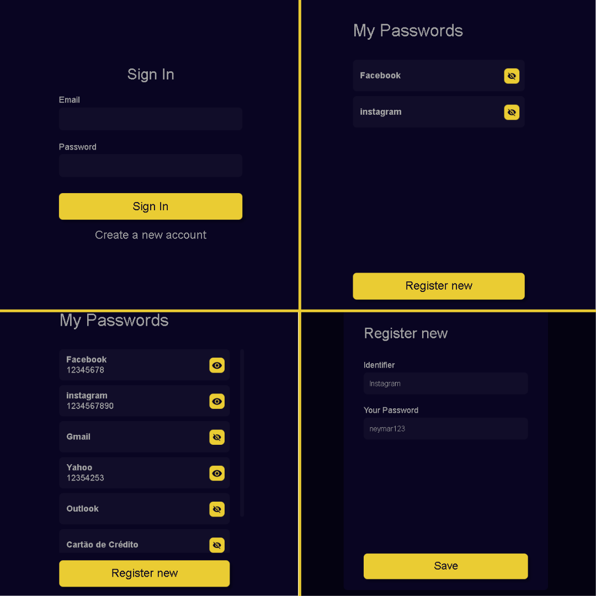

<h1 align="center">Password Manager</h1>

<div align="center">
  
</div>

# About this Project

  Password Manager was developed to help people who have difficulty remembering passwords, the user can store their passwords in a simple way.

# Some Observations about this App

- There's no functionality of Login/Register.

# Built With

- [ReactJS](https://nextjs.org/docs) - Build app using ReactJS and Typescript.
- [React-Modal](https://reactcommunity.org/react-modal/) - Modal Component.
- [React-Router](https://v5.reactrouter.com/web/guides/quick-start) - For Router.
- [Axios](https://axios-http.com/docs/intro) - HTTP Client.
- [MirageJS](https://miragejs.com/docs/getting-started/introduction/) - Fake API.
- [Styled-Components](https://styled-components.com/) - Styles.

# Getting Started

### Installing

**Cloning the Repository**

```
$ git clone https://github.com/LeonardoBrum0907/Password_Manager.git

$ cd Password_Manager
```

**Installing dependencies**

```
$ yarn
```

_or_

```
$ npm install
```
